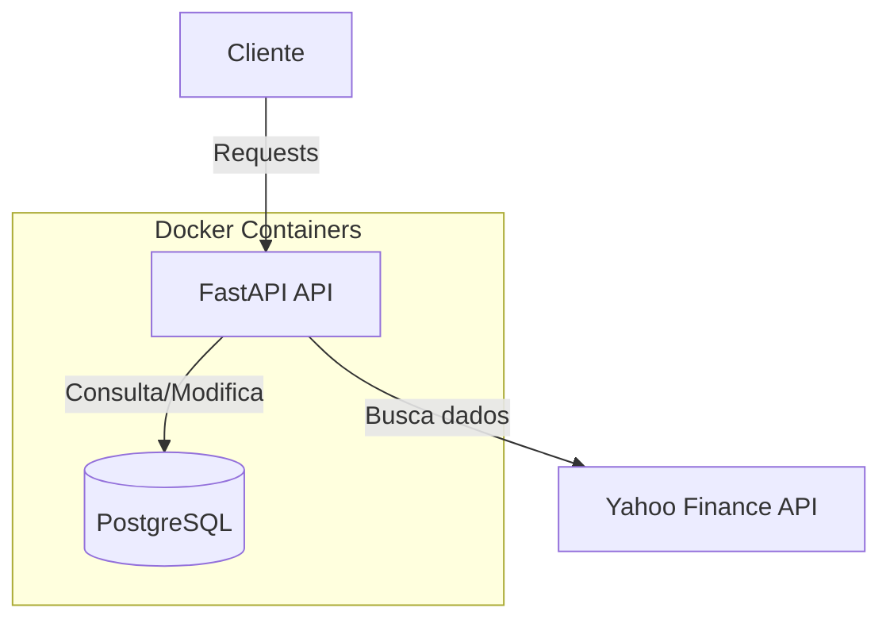
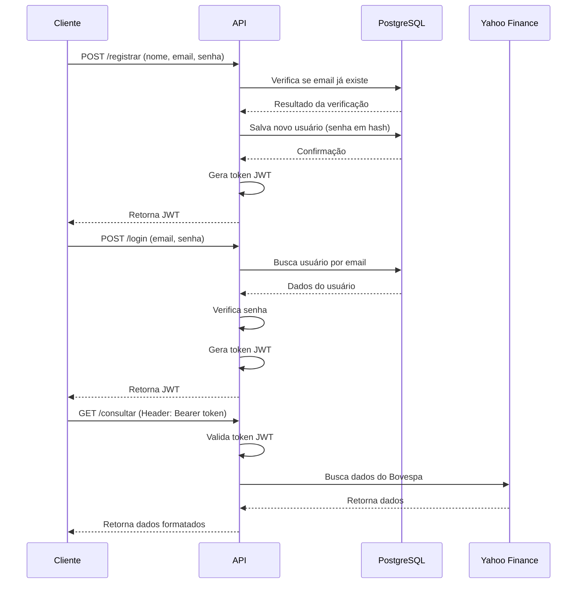
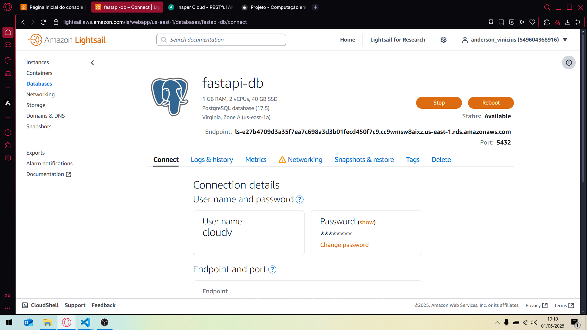
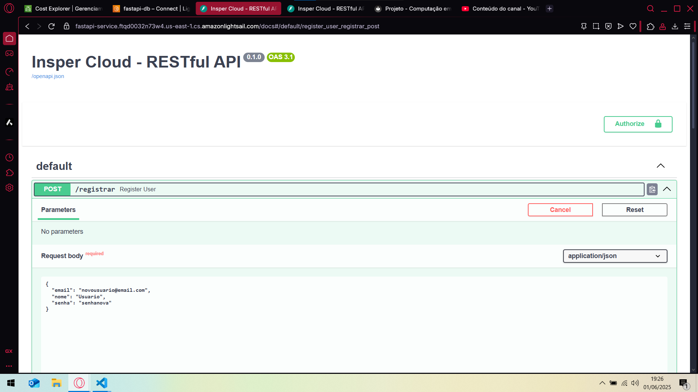
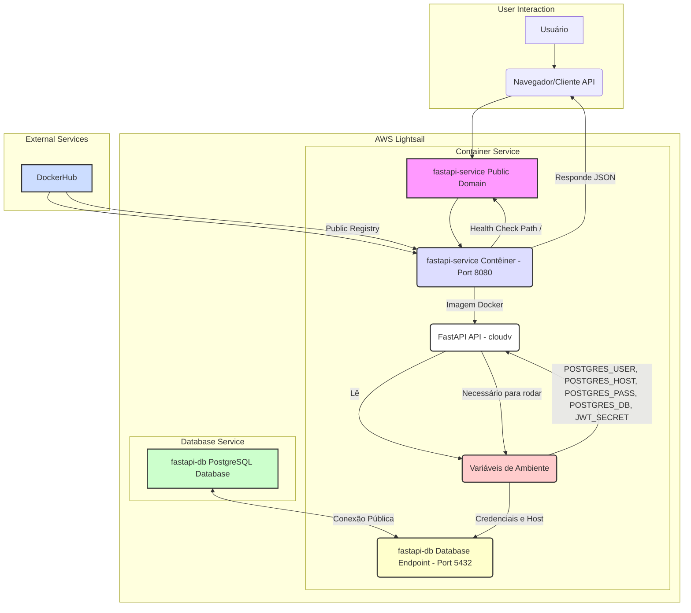
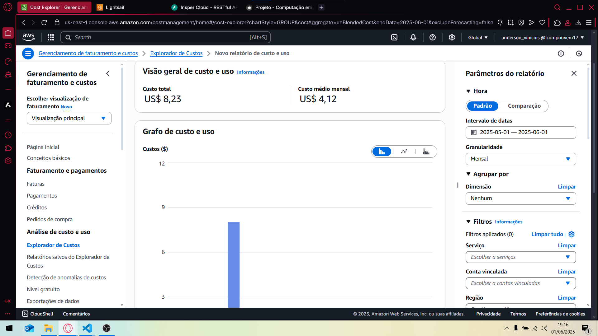

# Insper Cloud - Projeto Semestral ETAPA 1

Este projeto consiste em uma API RESTful desenvolvida com FastAPI, capaz de cadastrar e autenticar usuários, além de permitir a consulta de dados de terceiros (cotações do Índice Bovespa).

## Arquitetura

O projeto segue uma arquitetura em camadas, utilizando:

- **FastAPI**: Framework web para criar a API
- **PostgreSQL**: Banco de dados relacional para armazenar dados de usuários
- **SQLAlchemy**: ORM para interação com o banco de dados
- **Docker**: Para containerização da aplicação

## Vídeo de explicação do funcionamento da Aplicação localmente

[https://youtu.be/UWX2HL2aMkw](https://youtu.be/UWX2HL2aMkw)

## Docker Hub

A imagem da API está disponível no Docker Hub:

```
$ docker pull crowdi/insper-cloud-projeto:latest
```

Link para o Docker Hub: [https://hub.docker.com/r/crowdi/insper-cloud-projeto](https://hub.docker.com/r/crowdi/insper-cloud-projeto)

### Comandos utilizados para publicação no Docker Hub

```bash
# Fazer login no Docker Hub
docker login

# Construir a imagem
docker build -t crowdi/insper-cloud-projeto:latest ./api

# Enviar a imagem para o Docker Hub
docker push crowdi/insper-cloud-projeto:latest
```

### Diagrama de Arquitetura



### Fluxo de Funcionamento



## Como Executar a Aplicação

### Usando Docker Compose (Recomendado)

1. Certifique-se de ter o Docker e Docker Compose instalados no seu sistema.
2. Clone este repositório.
3. Na raiz do projeto, execute:

```bash
docker compose up -d
```

Isso iniciará tanto a API quanto o banco de dados. A API estará disponível em `http://localhost:8080`.

### Variáveis de Ambiente

Por padrão, o projeto usa valores padrão para as variáveis de ambiente. Você pode personalizá-las criando um arquivo `.env` na raiz do projeto com os seguintes valores:

```
POSTGRES_USER=seu_usuario
POSTGRES_PASSWORD=sua_senha
POSTGRES_DB=nome_do_banco
JWT_SECRET_KEY=sua_chave_secreta
```

## Documentação da API

### Endpoints

#### `POST /registrar`

Registra um novo usuário no sistema.

**Request:**
```json
{
    "nome": "Disciplina Cloud",
    "email": "cloud@insper.edu.br",
    "senha": "cloud0"
}
```

**Response:**
```json
{
    "jwt": "eyJhbGciOiJIUzI1NiIsInR5cCI6IkpXVCJ9..."
}
```

#### `POST /login`

Autentica um usuário existente.

**Request:**
```json
{
    "email": "cloud@insper.edu.br",
    "senha": "cloud0"
}
```

**Response:**
```json
{
    "jwt": "eyJhbGciOiJIUzI1NiIsInR5cCI6IkpXVCJ9..."
}
```

#### `GET /consultar`

Obtém dados das cotações do Índice Bovespa dos últimos 10 dias. Requer autenticação.

**Headers:**
```
Authorization: Bearer <seu_token_jwt>
```

**Query Parameters:**
- `format`: "json" (padrão) ou "csv"

**Response (JSON):**
```json
[
    {"Date":"2024-09-05","Open":136112.0,"High":136656.0,"Low":135959.0,"Close":136502.0,"Volume":7528700},
    {"Date":"2024-09-06","Open":136508.0,"High":136653.0,"Low":134476.0,"Close":134572.0,"Volume":7563300},
    // mais dias...
]
```

**Response (CSV):**
```
Date,Open,High,Low,Close,Volume
2024-09-05,136112.0,136656.0,135959.0,136502.0,7528700
2024-09-06,136508.0,136653.0,134476.0,134572.0,7563300
// mais dias...
```

## Arquivo compose.yaml

O arquivo `compose.yaml.entrega` está localizado na raiz do projeto. Este arquivo define os serviços necessários para a aplicação, incluindo a API e o banco de dados PostgreSQL.

Para uma execução em produção, ele utiliza a imagem publicada no Docker Hub:

```yaml
name: insper-cloud-projeto

services:
  app:
    image: crowdi/insper-cloud-projeto:latest
    container_name: app
    ports:
      - "8080:8080"
    depends_on:
      - db
    environment:
      - POSTGRES_USER=${POSTGRES_USER:-projeto}
      - POSTGRES_PASSWORD=${POSTGRES_PASSWORD:-projeto}
      - POSTGRES_HOST=db
      - POSTGRES_PORT=5432
      - POSTGRES_DB=${POSTGRES_DB:-projeto}
      - JWT_SECRET_KEY=${JWT_SECRET_KEY:-insper_cloud_projeto_secretkey}
    restart: always

  db:
    image: postgres:17
    container_name: database
    environment:
      - POSTGRES_USER=${POSTGRES_USER:-projeto}
      - POSTGRES_PASSWORD=${POSTGRES_PASSWORD:-projeto}
      - POSTGRES_DB=${POSTGRES_DB:-projeto}
    volumes:
      - postgres_data:/var/lib/postgresql/data
    restart: always

volumes:
  postgres_data:
```

## Tecnologias Utilizadas

- **Python 3.11**: Linguagem de programação
- **FastAPI**: Framework web para API
- **PostgreSQL**: Banco de dados relacional
- **SQLAlchemy**: ORM para banco de dados
- **PyJWT**: Para geração e validação de tokens JWT
- **Passlib**: Para hash de senhas
- **Docker**: Para containerização
- **Docker Compose**: Para orquestração de contêineres 

---

# Implementando uma Aplicação com FastAPI e PostgreSQL no LightSail da AWS

Agora vamos detalhar o processo de deploy de uma aplicação (API) e seu banco de dados no Amazon LightSail, um serviço da AWS que oferece uma interface mais simplificada e intuitiva para gerenciar recursos de nuvem, ideal para pequenos e médios projetos. O foco principal é na utilização de dois serviços específicos: **Databases** para o PostgreSQL e **Containers** para a API FastAPI.

## **Vídeo da API funcionando no LightSail**

[https://youtu.be/MnFQXdPm7ME](https://youtu.be/MnFQXdPm7ME)

## 1. Configuração do Banco de Dados (PostgreSQL)

O primeiro passo é configurar e deployar o banco de dados.

### 1.1. Criação da Instância do Banco de Dados

1.  **Acessar LightSail:** No console da AWS, procure por "LightSail" e clique no serviço.
2.  **Navegar para Databases:** No menu lateral esquerdo, selecione a aba `Databases`.
3.  **Criar Novo Banco de Dados:** Clique no botão `Create database`.
4.  **Localização e Região:** O LightSail pré-seleciona a região `Virginia, Zone A (us-east-1a)`. Recomenda-se manter esta região para este projeto.
5.  **Escolha do Banco de Dados:** Selecione `PostgreSQL` e a versão `17.5`.
6.  **Credenciais de Login (Opcional, mas recomendado):**
    *   Marque `Specify login credentials`.
    *   **User name:** Mantenha o que for mais relevante para o seu caso.
    *   **Password:** É possível gerar uma senha forte automaticamente (`Create a strong password for me`) ou definir uma senha personalizada.
7.  **Nome do Banco de Dados Mestre:**
    *   Marque `Specify the master database name`.
    *   O nome padrão é `dbmaster`. No projeto mantivemos esse nome. Defina o que for mais relevante para o seu caso.
8.  **Escolha do Plano do Banco de Dados:**
    *   São apresentadas várias opções de planos, variando em preço, memória, vCPUs, SSD e transferência de dados.
    *   Selecionamos o plano de **$15 USD/mês**, que inclui:
        *   1 GB de RAM
        *   2 vCPUs
        *   40 GB SSD
        *   100 GB de Transferência de Dados
    *   **Observação:** Este plano oferece os primeiros 90 dias gratuitos.
9.  **Identificação do Banco de Dados:** Dê um nome único ao seu banco de dados. No nosso projeto, o nome já existente é `fastapi-db`.
10. **Tags (Opcional):** Adicionar tags para organização e controle de faturamento.
11. **Criar Banco de Dados:** Clique em `Create database`. O processo pode levar alguns minutos.

### 1.2. Detalhes de Conexão do Banco de Dados

Após a criação, ao clicar no banco de dados, você encontrará os detalhes de conexão.

*   **Endpoint:** Este é o endereço principal do seu banco de dados (ex: `caracteresaleatorios.us-east-1.rds.amazonaws.com`). **Extremamente importante copiar este endpoint**, pois será usado como uma variável de ambiente na sua API.
*   **Porta:** `5432` (porta padrão do PostgreSQL).
*   **User name:** `cloudv`
*   **Password:** (A senha definida durante a criação).
*   **Modo Público:** É crucial que o **Public mode esteja habilitado**. Isso permite que sua aplicação (que estará em um contêiner separado) se conecte ao banco de dados, mesmo que não estejam na mesma zona de disponibilidade privada. Sem isso, a API não conseguiria se comunicar com o banco de dados.

### Database funcionando no LightSail



## 2. Configuração do Serviço de Contêineres (FastAPI API)

Agora, configuraremos o serviço para hospedar a API FastAPI.

### 2.1. Criação e Configuração do Serviço de Contêineres

1.  **Navegar para Containers:** No menu lateral esquerdo, selecione a aba `Containers`.
2.  **Criar Novo Serviço de Contêineres:** Clique no botão `Create container service`.
3.  **Localização:** A região padrão será a mesma do banco de dados (`Virginia, all zones (us-east-1)`).
4.  **Capacidade do Serviço de Contêineres (Power):**
    *   Escolha o poder computacional necessário para sua API.
    *   No projeto selecionamos o plano **Micro ($10 USD/mês por nó)**, que inclui:
        *   1 GB de RAM
        *   0.25 vCPUs
    *   **Observação:** Este plano também oferece os primeiros 90 dias gratuitos.
5.  **Escala (Scale):**
    *   Define o número de nós (instâncias do contêiner) que sua aplicação terá.
    *   No nosso projeto mantemos `1` nó.
6.  **Configuração do Primeiro Deploy (`Set up your first deployment`):**
    *   **Container name:** Um nome para o seu contêiner (ex: `cloudv`).
    *   **Image:** Você precisa fornecer a URL da imagem Docker da sua aplicação, geralmente hospedada no Docker Hub.
        *   `seu_nome_de_usuario_do_docker/nome_da_imagem_no_dockerhub`: O nome do repositório/imagem.
        *   `:latest`: A tag da imagem (indicando a versão mais recente).
    *   **Launch command (Opcional):** Um comando para iniciar o contêiner (ex: `launch.sh`).
    *   **Environment variables (Variáveis de Ambiente):** ESTE É UM PASSO CRÍTICO. Aqui você passa as credenciais do banco de dados e outras chaves secretas para a sua API. Se houver qualquer erro de digitação ou valor incorreto, a API não conseguirá se conectar ao banco ou funcionar corretamente.
        *   `POSTGRES_USER`: `cloudv` (o mesmo usuário do banco de dados).
        *   `POSTGRES_HOST`: O **Endpoint** completo do banco de dados PostgreSQL que você copiou anteriormente (ex: `caracteresaleatorios.us-east-1.rds.amazonaws.com`).
        *   `POSTGRES_PASS`: A senha do banco de dados.
        *   `POSTGRES_DB`: `postgres` (o nome do banco de dados principal).
        *   `JWT_SECRET`: `insper_cloud_projeto_secretkey` (uma chave secreta para tokens JWT, específica da aplicação).
    *   **Open ports (Portas Abertas):**
        *   Porta: `8080` (porta padrão para aplicações web).
        *   Protocolo: `HTTP`.
    *   **Public Endpoint:**
        *   Escolha o contêiner que servirá como endpoint público (`cloudv`).
        *   Porta: `8080`.
        *   Health check path: `/` (para verificar se a API está online).

7.  **Identificar seu Serviço:** Dê um nome único para o seu serviço de contêiner. No nosso projeto, o nome já existente é `fastapi-service`.      

8.  **Criar Serviço de Contêineres:** Clique em `Create container service`. O deploy pode levar alguns minutos.

### FastAPI funcionando no LightSail


## 3. Testando a Aplicação Deployada

Após o deploy, o status do serviço de contêineres deve mudar para "Running".

1.  **Acessar a API:**
    *   O LightSail fornecerá um `Public domain` para seu serviço (ex: `caracteresaleatorios.us-east-1.cs.amazonlightsail.com`).  
    *   Ao acessar este domínio no navegador, você verá a resposta padrão da API: `{"status":"API is running"}`.
2.  **Acessar a Documentação (Swagger UI):**
    *   Para ver a documentação interativa da API, adicione `/docs` ao final do domínio público (ex: `caracteresaleatorios.us-east-1.cs.amazonlightsail.com/docs`).
    *   Isso abre a interface Swagger UI, que lista todos os endpoints da API (POST, GET, etc.) e seus respectivos parâmetros e exemplos de requisição/resposta.
3.  **Testando as Funcionalidades:**
    *   **`/registrar` (POST):** Para registrar um novo usuário (email, nome, senha). A execução bem-sucedida retorna um token JWT.        
    *   **`/login` (POST):** Para fazer login com um usuário existente (email, senha). Também retorna um token JWT.
    *   **`/consultar` (GET):** Para consultar dados do Bovespa. Requer que o usuário esteja autenticado (JWT). Você precisa colar o JWT obtido no login no campo "Authorize" da interface do Swagger UI para que esta requisição funcione.


### API funcionando com endpoints



## 4. Arquitetura do Projeto (Diagrama Mermaid)



**Explicação dos Componentes:**

*   **Usuário/Navegador/Cliente API:** O cliente que interage com a aplicação (ex: um navegador web, Postman, cURL).
*   **`fastapi-service` Public Domain:** O endpoint público fornecido pelo LightSail para a API, roteando o tráfego para o serviço de contêineres.
*   **`fastapi-service` Contêiner:** A instância do contêiner onde a API FastAPI é executada. Ele expõe a porta `8080`.
*   **FastAPI API (`cloudv`):** A aplicação Python com FastAPI que processa as requisições HTTP.
*   **Variáveis de Ambiente:** Configuradas no serviço de contêineres, contêm informações sensíveis e de configuração (usuário, host, senha do DB, chaves secretas). A API lê essas variáveis para se configurar.
*   **`fastapi-db` Database Endpoint:** O endpoint do banco de dados PostgreSQL fornecido pelo LightSail, acessível publicamente (Public mode enabled).
*   **`fastapi-db` PostgreSQL Database:** O banco de dados PostgreSQL gerenciado pelo LightSail, onde os dados da aplicação são armazenados.
*   **DockerHub:** Repositório público de imagens Docker, de onde o LightSail baixa a imagem da sua API para deploy.

## 5. Custos até agora do LightSail (01/06/2025)



## 6. Estimativa de Custo Mensal da Infraestrutura

Com base nos planos selecionados no nosso projeto:

*   **Banco de Dados (PostgreSQL `fastapi-db`):** $15 USD/mês (plano de 1GB RAM, 2 vCPUs).
*   **Serviço de Contêineres (Micro - `fastapi-service`):** $10 USD/mês por nó (1GB RAM, 0.25 vCPUs).

**Custos Projetados:**

*   **Para 1 instância de contêiner:**
    *   Custo DB: $15 USD
    *   Custo Contêiner: $10 USD (1 nó * $10/nó)
    *   **Total: $25 USD/mês** (≤ USD 50)
*   **Para 5 instâncias de contêiner:**
    *   Custo DB: $15 USD
    *   Custo Contêiner: $50 USD (5 nós * $10/nó)
    *   **Total: $65 USD/mês** (Excede USD 50)
*   **Para 10 instâncias de contêiner:**
    *   Custo DB: $15 USD
    *   Custo Contêiner: $100 USD (10 nós * $10/nó)
    *   **Total: $115 USD/mês** (Excede USD 50)

## 7. Detalhes da Integração App ↔ Banco de Dados

A integração entre a aplicação FastAPI (executando em um contêiner no LightSail) e o banco de dados PostgreSQL (também no LightSail) é crucial para o funcionamento do sistema. Essa comunicação é estabelecida principalmente através de **variáveis de ambiente** e da configuração 
de **rede**.

*   **Host do Banco de Dados (`POSTGRES_HOST`):** Em vez de usar `localhost` ou um IP privado, a API se conecta ao banco de dados utilizando o `Endpoint` público fornecido pelo LightSail. Este endpoint é um nome de domínio completamente qualificado (FQDN) que resolve para o endereço IP do banco de dados na rede da AWS. Essa abordagem é necessária porque o serviço de contêineres e a instância do banco de dados podem estar em diferentes recursos lógicos ou mesmo em diferentes zonas de disponibilidade.
*   **Porta do Banco de Dados (`5432`):** A comunicação com o PostgreSQL ocorre na porta padrão `5432`. Esta porta deve ser acessível publicamente no banco de dados para que a API possa se conectar a ele.
*   **Segurança e Acesso Público:**
    *   É importante destacar a necessidade de habilitar o **"Public mode"** para o banco de dados. Isso significa que o banco de dados aceitará 
conexões de qualquer lugar na internet (não apenas de outros recursos dentro da sua rede privada na AWS).
    *   Embora a habilitação do "Public mode" possa parecer um risco de segurança, no contexto do LightSail, para uma aplicação que precisa acessar o banco de dados a partir de um serviço de contêiner que pode ter um endpoint público, isso é muitas vezes uma configuração necessária.
    *   A segurança é mantida através das credenciais de login (usuário e senha) que são passadas para o banco de dados. A API deve sempre 
autenticar-se com as credenciais corretas para acessar os dados. Além disso, o uso de senhas fortes e rotação regular de senhas é recomendado. Para ambientes mais complexos, soluções como AWS RDS com VPCs e grupos de segurança são preferíveis para maior isolamento e controle de acesso.
*   **Variáveis de Ambiente (`POSTGRES_USER`, `POSTGRES_PASS`, `POSTGRES_DB`):** As credenciais de acesso ao banco de dados (usuário, senha e nome do banco) **nunca** devem ser hardcoded (escritas diretamente no código) na aplicação. Em vez disso, elas são injetadas no ambiente de execução do contêiner como variáveis de ambiente. O LightSail facilita essa configuração diretamente na interface de deploy do serviço 
de contêineres. Isso garante que as informações sensíveis não estejam expostas no código-fonte e possam ser facilmente alteradas sem a necessidade de modificar e redeployar a imagem Docker da aplicação.
*   **Chave Secreta JWT (`JWT_SECRET`):** Além das credenciais do banco de dados, a API também utiliza uma variável de ambiente para a chave secreta JWT. Esta chave é usada para assinar e verificar tokens de autenticação (JWTs). Manter essa chave como uma variável de ambiente é uma prática de segurança padrão, prevenindo o acesso não autorizado ou a falsificação de tokens.

Essa arquitetura permite que a aplicação e o banco de dados, embora gerenciados pelo LightSail, operem como serviços interdependentes na nuvem, acessíveis e escaláveis.