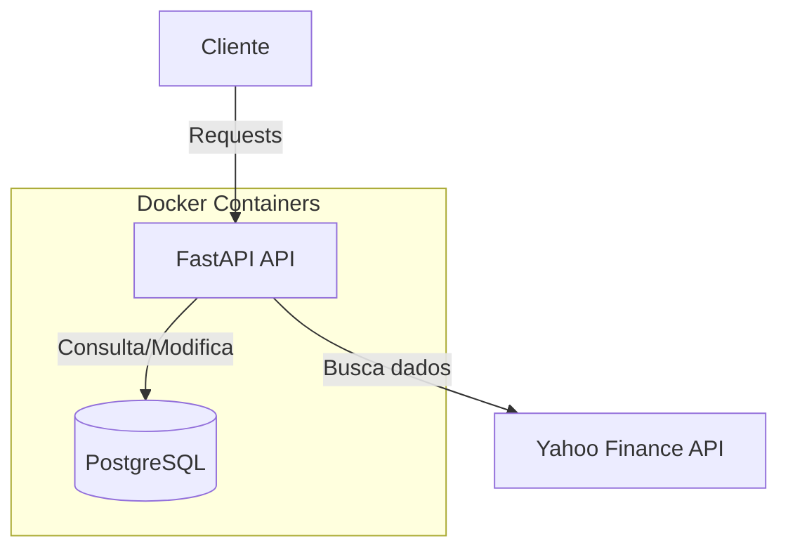
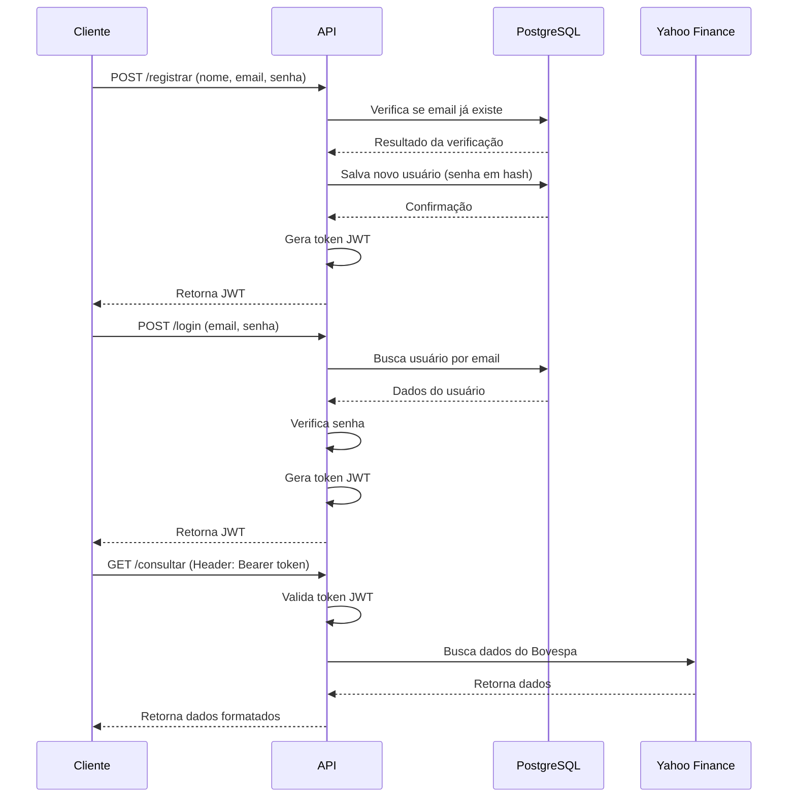

# Insper Cloud - Projeto Semestral

Este projeto consiste em uma API RESTful desenvolvida com FastAPI, capaz de cadastrar e autenticar usuários, além de permitir a consulta de dados de terceiros (cotações do Índice Bovespa).

## Arquitetura

O projeto segue uma arquitetura em camadas, utilizando:

- **FastAPI**: Framework web para criar a API
- **PostgreSQL**: Banco de dados relacional para armazenar dados de usuários
- **SQLAlchemy**: ORM para interação com o banco de dados
- **Docker**: Para containerização da aplicação

## Vídeo de explicação do funcionamento da Aplicação localmente

https://youtu.be/UWX2HL2aMkw

## Docker Hub

A imagem da API está disponível no Docker Hub:

```
$ docker pull crowdi/insper-cloud-projeto:latest
```

Link para o Docker Hub: [https://hub.docker.com/r/crowdi/insper-cloud-projeto](https://hub.docker.com/r/crowdi/insper-cloud-projeto)

### Comandos utilizados para publicação no Docker Hub

```bash
# Fazer login no Docker Hub
docker login

# Construir a imagem
docker build -t crowdi/insper-cloud-projeto:latest ./api

# Enviar a imagem para o Docker Hub
docker push crowdi/insper-cloud-projeto:latest
```

### Diagrama de Arquitetura



### Fluxo de Funcionamento



## Como Executar a Aplicação

### Usando Docker Compose (Recomendado)

1. Certifique-se de ter o Docker e Docker Compose instalados no seu sistema.
2. Clone este repositório.
3. Na raiz do projeto, execute:

```bash
docker compose up -d
```

Isso iniciará tanto a API quanto o banco de dados. A API estará disponível em `http://localhost:8080`.

### Variáveis de Ambiente

Por padrão, o projeto usa valores padrão para as variáveis de ambiente. Você pode personalizá-las criando um arquivo `.env` na raiz do projeto com os seguintes valores:

```
POSTGRES_USER=seu_usuario
POSTGRES_PASSWORD=sua_senha
POSTGRES_DB=nome_do_banco
JWT_SECRET_KEY=sua_chave_secreta
```

## Documentação da API

### Endpoints

#### `POST /registrar`

Registra um novo usuário no sistema.

**Request:**
```json
{
    "nome": "Disciplina Cloud",
    "email": "cloud@insper.edu.br",
    "senha": "cloud0"
}
```

**Response:**
```json
{
    "jwt": "eyJhbGciOiJIUzI1NiIsInR5cCI6IkpXVCJ9..."
}
```

#### `POST /login`

Autentica um usuário existente.

**Request:**
```json
{
    "email": "cloud@insper.edu.br",
    "senha": "cloud0"
}
```

**Response:**
```json
{
    "jwt": "eyJhbGciOiJIUzI1NiIsInR5cCI6IkpXVCJ9..."
}
```

#### `GET /consultar`

Obtém dados das cotações do Índice Bovespa dos últimos 10 dias. Requer autenticação.

**Headers:**
```
Authorization: Bearer <seu_token_jwt>
```

**Query Parameters:**
- `format`: "json" (padrão) ou "csv"

**Response (JSON):**
```json
[
    {"Date":"2024-09-05","Open":136112.0,"High":136656.0,"Low":135959.0,"Close":136502.0,"Volume":7528700},
    {"Date":"2024-09-06","Open":136508.0,"High":136653.0,"Low":134476.0,"Close":134572.0,"Volume":7563300},
    // mais dias...
]
```

**Response (CSV):**
```
Date,Open,High,Low,Close,Volume
2024-09-05,136112.0,136656.0,135959.0,136502.0,7528700
2024-09-06,136508.0,136653.0,134476.0,134572.0,7563300
// mais dias...
```

## Arquivo compose.yaml

O arquivo `compose.yaml.entrega` está localizado na raiz do projeto. Este arquivo define os serviços necessários para a aplicação, incluindo a API e o banco de dados PostgreSQL.

Para uma execução em produção, ele utiliza a imagem publicada no Docker Hub:

```yaml
name: insper-cloud-projeto

services:
  app:
    image: crowdi/insper-cloud-projeto:latest
    container_name: app
    ports:
      - "8080:8080"
    depends_on:
      - db
    environment:
      - POSTGRES_USER=${POSTGRES_USER:-projeto}
      - POSTGRES_PASSWORD=${POSTGRES_PASSWORD:-projeto}
      - POSTGRES_HOST=db
      - POSTGRES_PORT=5432
      - POSTGRES_DB=${POSTGRES_DB:-projeto}
      - JWT_SECRET_KEY=${JWT_SECRET_KEY:-insper_cloud_projeto_secretkey}
    restart: always

  db:
    image: postgres:17
    container_name: database
    environment:
      - POSTGRES_USER=${POSTGRES_USER:-projeto}
      - POSTGRES_PASSWORD=${POSTGRES_PASSWORD:-projeto}
      - POSTGRES_DB=${POSTGRES_DB:-projeto}
    volumes:
      - postgres_data:/var/lib/postgresql/data
    restart: always

volumes:
  postgres_data:
```

## Tecnologias Utilizadas

- **Python 3.11**: Linguagem de programação
- **FastAPI**: Framework web para API
- **PostgreSQL**: Banco de dados relacional
- **SQLAlchemy**: ORM para banco de dados
- **PyJWT**: Para geração e validação de tokens JWT
- **Passlib**: Para hash de senhas
- **Docker**: Para containerização
- **Docker Compose**: Para orquestração de contêineres 
