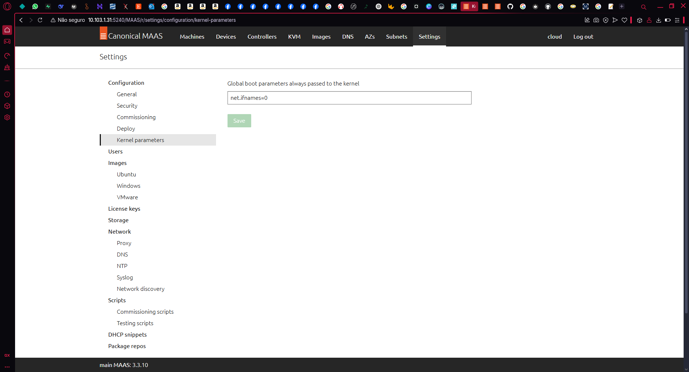
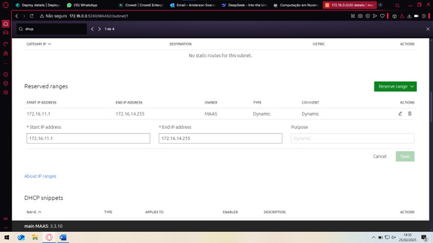
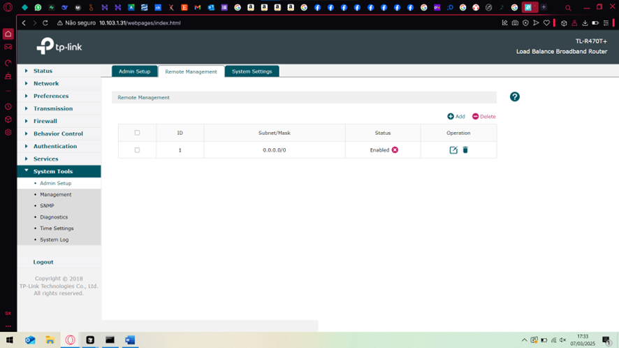

## Objetivo

- Entender os conceitos básicos sobre uma plataforma de gerenciamento de hardware.
- Introduzir conceitos básicos sobre redes de computadores.

## Montagem do Roteiro

### Tarefa 1: Instalar o MaaS
O MaaS um software de código aberto e suportado pela Canonical. O MAAS trata servidores físicos como máquinas virtuais ou instâncias na nuvem. 
Esse software possui diversas versões, mas para esse projeto iremos utilizar a versão stable 3.5.3.

Primeiro atualizamos os pacotes do sistema:

```sudo apt update && sudo apt upgrade -y```
   
Em seguida fazemos a instalação:

```
sudo snap install maas --channel=3.5/stable
sudo snap install maas-test-db
```

### Tarefa 2: Acessando e configurando o MaaS
Ainda conectado a máquina local pelo cabo Ethernet podemos acessar a máquina main através da nossa máquina pessoal utilizando o SSH:

```
ssh cloud@172.16.0.3
```


- Inicializando o MaaS

```
sudo maas init region+rack --maas-url http://172.16.0.3:5240/MAAS --database-uri maas-test-db:///
sudo maas createadmin
```

Nessa parte devemos criar um login e uma senha. Pelo padrão da disciplina iremos criar o admin como "cloud" e a senha "cloud"+"letra do Kit", neste caso "cloudv"


- Gerando o par de chaves para autenticação
  
Em seguida, precisamos gerar as chaves para autenticar através do comando:

```
ssh-keygen -t rsa
```


Gerando a chave, devemos copiar e guardar em uma pasta: 


```
cat ./.ssh/id_rsa.pub
```

- Acessando o dashboard do MaaS

Após esses passos é possível acessar o dashboard do MaaS para dar sequência as outras configurações necessárias através do link [http://172.16.0.3:5240/MAAS](http://172.16.0.3:5240/MAAS)

Agora precisamos configurar o DNS forwarder com o DNS do Insper. Para isso precisamos acessar a aba Settings/Network/DNS do dashboard:


Agora vamos importar as imagens do Ubuntu 22 e 24 no dashboard:


Em seguida devemos definir o Global Kernel Parameters:



### Tarefa 3: Chaveando o DHCP

Nessa etapa precisamos habilitar o DHCP no MaaS Controller, definindo o range de IPs iniciar em 172.16.11.1 e acabar em 172.16.14.255. Além disso, tem que deixar o DNS da subnet apontando para o DNS do Insper.




### Tarefa 4: Checando a saúde do Maas

Dentro do dashboard, na aba de Controladores, é possível checar a "saúde" do sistema Maas. Nessa página deve haver uma marca de seleção verde ao lado dos itens 'regiond' até 'dhcpd':


### Tarefa 5: Comissionando os servidores

Agora é o momento de cadastrar (fazer o host) de todas as máquinas do server1 até o server5 através da aba Machines do dashboard do MaaS. Para isso algumas instruções devem ser seguidas:

- Ao cadastrar as máquinas devemos preencher as opções:
   - Preencher a opção Power Type com Intel AMT
   - Inserir MacAddress da máquina respectiva, esse valor está escrito em cada máquina na parte de baixo
   - Inserir a senha como _CloudComp6s!_
   - IP do AMT = 172.16.15.X (sendo X o id do server, por exemplo server1 = 172.16.15.1)

Em seguida, devemos checar todos os nós e verificar se estão todos com o status Ready, além de verificar também o hardware como memória, SSD etc.


Ainda resta um último dispositivo para cadastrar, neste caso o roteador. Adicionamos o roteador pela aba Devices do dashboard do MaaS:


### Tarefa 6: Criando OVS bridge

Uma Open vSwitch (OVS) bridge reduz a necessidade de duas interfaces de rede físicas. As pontes OVS são criadas na aba NetWork ao configurar um nó (machine). Aqui, vamos criar uma ponte a partir da interface regular 'eth0'. O nome da ponte vai ser referenciado em outras partes e como exigência da disciplina iremos chamar de 'br-ex':


Devemos fazer esse procedimento para cada uma das machines da nossa nuvem.

### Tarefa 7: Fazendo acesso remoto ao kit

Agora vamos realizar um NAT para permitir o acesso da "Rede Wi-fi Insper" do computador pessoal ao servidor MAIN, a ideia é utilizar a porta 22. Além disso, temos que configurar uma porta para acessar o MaaS remotamente, usaremos a porta 5240 e configurar no roteador na aba Transmisson -> NAT:


Também é necessário liberar o acesso ao gerenciamento remoto do roteador criando uma regra de gestão para a rede 0.0.0.0/0, na aba System Tools -> Admin Setup -> Remote Management:



Assim já é possível acessar remotamente sem precisar conectar o cabo Ethernet diretamente no Switch. Neste caso, precisamos utilizar um IP diferente disponível no dashboard do roteador na página principal em WAN IPv4 -> WAN1 -> IP Address


## Bare Metal: Django em nuvem

Com a infra pronta agora vamos fazer deploy de uma aplicação Django. Mas antes, precisamos configurar um ajuste no DNS, dentro da aba Subnets clicar na subnet 172.16.0.0/20 e editar a Subnet summary colocando o DNS do Insper - 172.20.129.131


### Primeira Parte: Banco de Dados

Primeiro vamos acessar o dashboard do MaaS na aba Machines e fazer deploy do ubuntu 24.04 no server1. Acessando o dashboard do server1 e em "Take Action" selecionar a versão do Ubuntu 24 e habilitar o script para inserir a chave ssh que foi obtida anteriormente e pode ser recuperada com o comando: 

```
cat ./.ssh/id_rsa.pub
```


Em seguida acessamos o server1 pelo terminal via SSH. Primeiro acessamos a main:

```
ssh cloud@10.103.1.31
```
> Esse IP é para acesso remoto pela rede do Insper

Depois acessamos o server1:

```
ssh ubuntu@172.16.8.196
```
> Esse IP é o que aparece no dashboard do MaaS na aba Machines e aparece logo abaixo do nome de cada server

Agora dentro do server1 vamos dar continuidade com o bando de dados, para isso executamos os comandos:

```
sudo apt update
sudo apt install postgresql postgresql-contrib -y
```

Ainda dentro do server1 precisamos criar um usuário:

```
sudo su - postgres
createuser -s cloud -W
```
> Utilizar a senha cloud

Agora vamos criar o database:

```
createdb -O cloud tasks
```

Agora expor o serviço para acesso e remover o comentário e substituir a string da linha para aceitar conexões remotas:

```
nano /etc/postgresql/16/main/postgresql.conf
```
```
listen_addresses = '*'
```

Depois vamos liberar para qualquer máquina dentro da subnet do kit:

```
nano /etc/postgresql/<versão>/main/pg_hba.conf
```
Alterando a linha:

```
  host    all             all             172.16.0.0/20          trust
```

Em seguida, vamos sair do usuário postgres, liberar o firewall e reiniciar o serviço:

```
sudo ufw allow 5432/tcp
sudo systemctl restart postgresql
```

É importante verificar o status do database e checar se há erros. Para isso executamos os comandos:

```
sudo systemctl status postgresql

telnet localhost 5432

telnet 172.16.0.196 5432

sudo ss -tulnp | grep postgres
```


### Tarefa 2

Agora vamos retornar ao dashboard do MAAS para fazer o deploy do server2. Acessando o dashboard do server2 e em "Take Action" selecionar a versão do Ubuntu 24 e habilitar o script para inserir a chave ssh que foi obtida anteriormente e pode ser recuperada com o comando: 

```
cat ./.ssh/id_rsa.pub
```

Em seguida, acessar o SSH do server2 e clonar o seguinte repositório:

```
git clone https://github.com/raulikeda/tasks.git
```

Esse repositório tasks tem algumas atividades pré-configuradas que iremos utilizar para preparar todo o nosso ambiente do server2. Esse repositório:

- Atualiza o sistema (apt update e apt upgrade).

- Instala pacotes essenciais como Git, curl, snapd, etc.

- Instala ferramentas como Django, Python, Postgres.

Agora entrando no diretório e entrando na pasta tasks:

```
cd tasks
```

Executamos o comando:

```
./install.sh
```

Com isso todo o ambiente do server2 está pronto e com a aplicação django instalada.


Podemos acessar a aplicação django utilizando um túnel SSH e com esse serviço temporário podemos usar a aplicação fora do kit enquanto o terminal que o tunnel estiver utilizando esteja ativo. Para isso, saímos da main e entramos novamente com o seguinte comando utilizando tunnel:

```
```

## App


### Tarefa 1

### Tarefa 2

Exemplo de diagrama


[Mermaid](https://mermaid.js.org/syntax/architecture.html){:target="_blank"}

## Discussões

Quais as dificuldades encontradas? O que foi mais fácil? O que foi mais difícil?

## Conclusão

O que foi possível concluir com a realização do roteiro?
