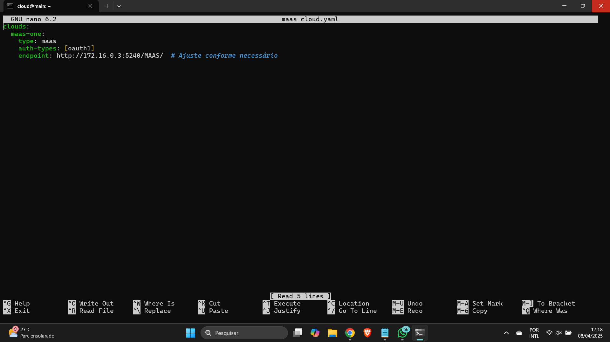
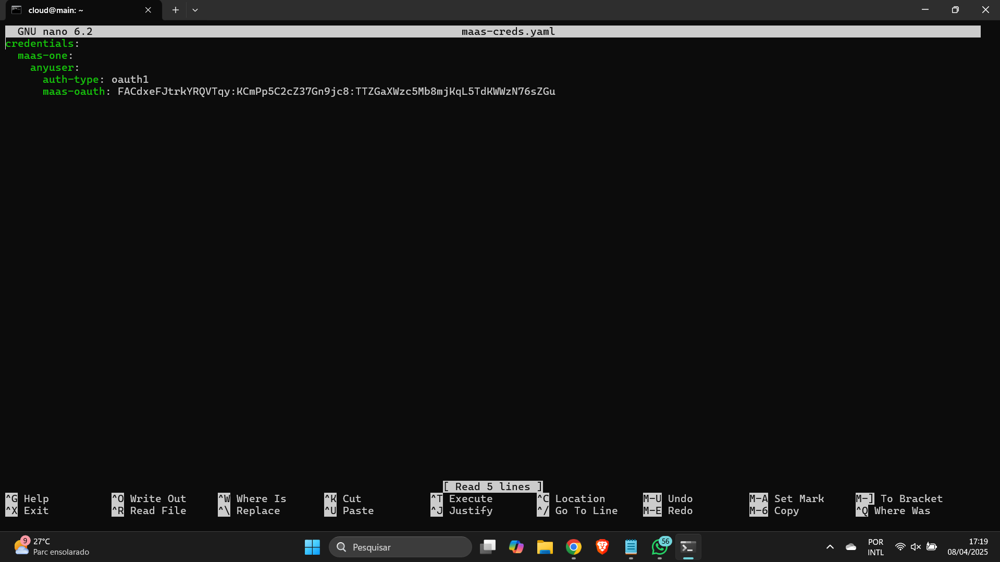
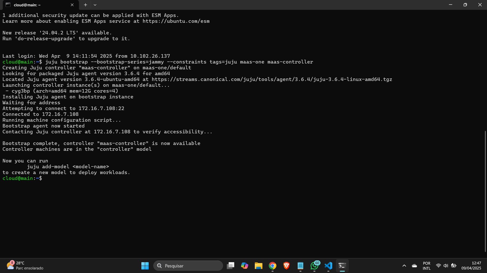
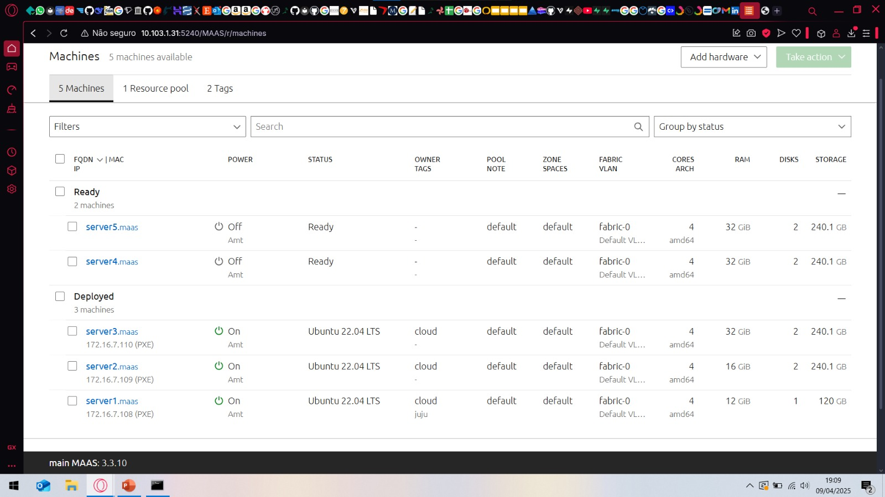
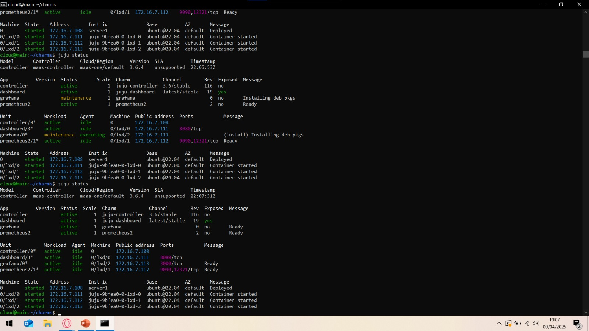
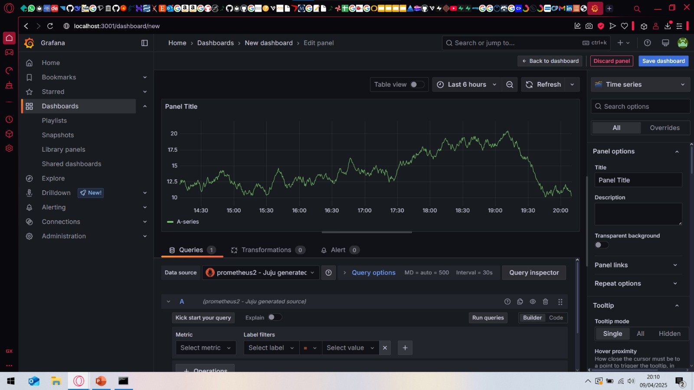
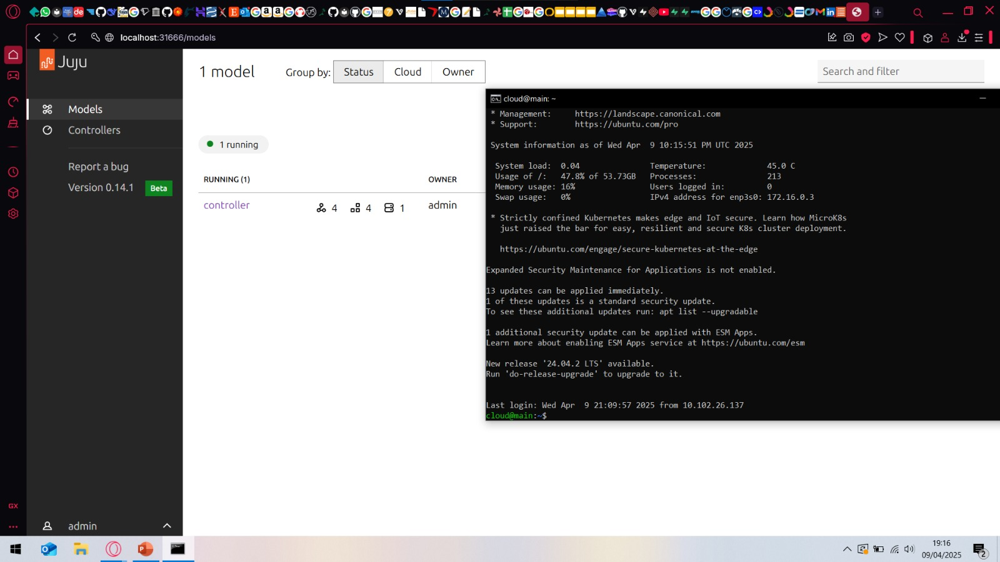
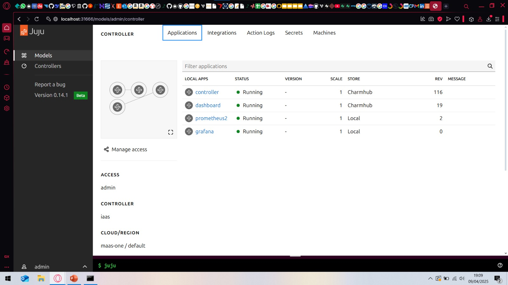

# Objetivos

- Entender os conceitos básicos sobre uma plataforma de gerenciamento de aplicações distribuídas.
- Entender os conceitos básicos de comunicação entre aplicações e serviços.


# Infra

### Criando uma infraestrutura para deploy com o Juju

Primeiramente, acessamos a main via SSH e usamos o seguinte comando para instalar o Juju

```
sudo snap install juju --channel 3.6
```

Na sequência, precisamos adicionar o cluster MAAS para que o Juju possa gerenciá-lo como uma Cloud. Fazemos isso através de um arquivo de definição de cloud, como maas-cloud.yaml.

Criando o arquivo:

```
nano maas-cloud.yaml
```

Adicionando as informações necessárias:



Em seguida, adicionamos a Cloud ao Juju com o seguinte comando:

```
juju add-cloud --client -f maas-cloud.yaml maas-one
```

É necessário, ainda, vincular um arquivo de credenciais para que o Juju possa integragir com a cloud adicionada. Vamos novamente usar um arquivo para importar nossas informações, como maas-creds.yaml:

Criando o arquivo:

```
nano maas-creds.yaml
```

Adicionando as informações necessárias:



Em seguida, vinculamos as credenciais à cloud:

```
juju add-credential --client -f maas-creds.yaml maas-one
```

Para finalizar, criamos o controlador do server1, rotulando a máquina via MAAS com o rótulo "juju" e executamos o seguinte comando:

```
juju bootstrap --bootstrap-series=jammy --constraints tags=juju maas-one maas-controller
```

Que faz o deploy da aplicação do controlador, "maas-controller", no server1.




# App

### Instalação do Dashboard do Juju

Para fazer o deploy do dashboard, primeiro mudamos para o modelo do controlador:

```
juju switch maas-controller:admin/maas
```

Em seguida, fazemos o deploy do dashboard:

```
juju deploy juju-dashboard dashboard
```

Então, integramos o controlador ao dashboard:

```
juju integrate dashboard controller
```

Por fim, expomos o painel:

```
juju expose dashboard
```

Agora já podemos acessar o Juju Dashboard com o comando ```juju dashboard```.

---

### Deploy do Grafana com Prometheus usando Juju

O **Grafana** é uma plataforma de código aberto que permite visualizar dados em tempo real por meio de gráficos e painéis. Para funcionar corretamente, ele precisa de um banco de dados que armazene suas configurações e metadados. Neste caso, vamos utilizar o **Prometheus**.

---

#### 1. Criar a pasta para armazenar os charms

Primeiro, criamos uma pasta chamada `charms` onde vamos baixar os charms do Grafana e do Prometheus:

```
mkdir -p /home/cloud/charms
cd /home/cloud/charms
```

---

#### 2. Baixar os charms do Charmhub

Agora, vamos fazer o download dos charms necessários:

```
juju download grafana
juju download prometheus2
```

---

#### 3. Fazer o deploy dos charms

Com os arquivos baixados, fazemos o deploy local dos charms:

**Deploy do Prometheus:**

```
juju deploy ./prometheus2_XXX.charm
```

**Deploy do Grafana:**

```
juju deploy ./grafana_XXX.charm
```

> Substitua `XXX` pela versão específica que foi baixada.

---

#### 4. Integrar Grafana com Prometheus

Com os serviços no ar, integramos o Grafana ao Prometheus:

```
juju integrate grafana prometheus2
```

---

#### 5. Acompanhar o status do deploy

Para acompanhar o andamento dos deploys e da integração em tempo real:

```
watch -n 1 juju status
```

---

### Tarefas

1. Print da tela do Dashboard do MAAS com as Maquinas e seus respectivos IPs.



2. Print de tela do comando "juju status" depois que o Grafana está "active".



3. Print da tela do Dashboard do Grafana com o Prometheus aparecendo como source.



4. Print do acesso ao Dashboard via network Insper.



5. Print na tela que mostra as aplicações sendo gerenciadas pelo JUJU.

