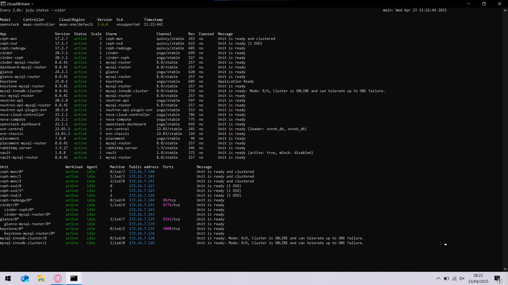

# Objetivos

- Entender os conceitos básicos de Private Cloud.

- Aprofundar conceitos sobre redes virtuais SDN.

# Infra

Este projeto visa construir um ambiente de nuvem privada utilizando OpenStack sobre uma infraestrutura gerenciada por MAAS e Juju, e então implantar uma aplicação específica nesse ambiente virtualizado.

Confira se os seus recursos fisicos seguem, no MÍNIMO, a tabela abaixo, volte ao dashboard do MAAS e crie as Tags conforme descrito:

| Node name   | Tag(s)      | CPUs | NICs | RAM  | Disks | Storage |
|-------------|-------------|------|------|------|-------|---------|
| node1.maas  | controller  | 2    | 1    | 12.0 | 1     | 80.0    |
| node2.maas  | reserva     | 2    | 1    | 16.0 | 2     | 80.0    |
| node3.maas  | compute     | 2    | 1    | 32.0 | 2     | 80.0    |
| node4.maas  | compute     | 2    | 1    | 32.0 | 2     | 80.0    |
| node5.maas  | compute     | 2    | 1    | 32.0 | 2     | 80.0    |

Antes de começar a instalação do Openstack, verifique se o MAAS está configurado corretamente (Brigdes, Subnets, Tags, etc).

Verifique se o bridge br-ex está configurado corretamente no MAAS. O br-ex é crucial para a comunicação do OpenStack com a rede externa. Ele deve estar configurado para TODOS os nós.

## Implementando o OpenStack

É importante não instalar nada no server2 que deve estar reservado, altere os comandos que forem necessários para utilizar o Node server 1 como controller, o node server 2 como Reserva e os nodes server 3,4 e 5 como compute (onde o Openstack será instalado).
Verifique o status (juju status) para ver se a implantação está correndo como o esperado.
Aguarde a instalação terminar, só vá para o próximo passo quando tiver certeza que o comando anterior foi finalizado
Esse roteiro é baseado na documentação oficial do Openstack, porém adaptado para o nosso ambiente. Logo, atente para o número de máquinas que você tem disponível e para a configuração de rede que você fez no MAAS.

Para monitorar o status da instalação do Openstack, você pode usar o comando abaixo:

```
watch -n 2 --color "juju status --color"
```

Em seguida, vamos começar a configurar o openstack pelo terminal da main:

```
juju add-model --config default-series=jammy openstack
```

```
juju switch maas-controller:openstack
```

### Ceph OSD

O aplicativo **ceph-osd** será implantado em três nós com o charm **ceph-osd**.

Os nomes dos dispositivos de bloco que sustentam os OSDs dependem do hardware nos nós do MAAS. Todos os dispositivos possíveis (em todos os nós) que serão usados para armazenamento do Ceph devem ser incluídos no valor da opção **osd-devices** (separados por espaço). Aqui, usaremos os mesmos dispositivos em cada nó: `/dev/sda` e `/dev/sdb`. O arquivo **ceph-osd.yaml** contém a configuração:

**ceph-osd.yaml**

```yaml
ceph-osd:
  osd-devices: /dev/sda /dev/sdb
```

Para implantar o aplicativo, usaremos a tag **compute** que foi atribuída a cada um desses nós na página *Instalar MAAS*. O comando para implantar o aplicativo **ceph-osd** é:

```bash
juju deploy -n 3 --channel quincy/stable --config ceph-osd.yaml --constraints tags=compute ceph-osd
```

**Nota**: A opção `-n 3` especifica que três unidades do aplicativo **ceph-osd** devem ser implantadas.

Se uma mensagem de uma unidade ceph-osd como **“Non-pristine devices detected”** aparecer na saída do comando `juju status`, será necessário usar as ações **zap-disk** e **add-disk** que acompanham o charm **ceph-osd**. A ação **zap-disk** é de natureza destrutiva. Use-a apenas se quiser apagar completamente o disco de todos os dados e assinaturas para uso pelo Ceph.

### Nova Compute

**Nova** é o projeto do OpenStack que fornece uma forma de provisionar instâncias de computação (também conhecidas como servidores virtuais). O charm **nova-compute** é implantado nos nós de computação com o charm **nova-compute**. O arquivo **nova-compute.yaml** contém a configuração:

**nova-compute.yaml**

```yaml
nova-compute:
  config-flags: default_ephemeral_format=ext4
  enable-live-migration: true
  enable-resize: true
  migration-auth-type: ssh
  virt-type: qemu
```

Os nós devem ser direcionados pelo ID da máquina, já que não há mais máquinas Juju (nós MAAS) livres disponíveis. Isso significa que estaremos colocando vários serviços em nossos nós. Escolhemos as máquinas **0, 1 e 2**. Para implantar:

```bash
juju deploy -n 3 --to 0,1,2 --channel yoga/stable --config nova-compute.yaml nova-compute
```

### MySQL InnoDB Cluster

O **MySQL InnoDB Cluster** sempre requer **pelo menos três unidades de banco de dados**. O aplicativo **mysql-innodb-cluster** é implantado em três nós com o charm **mysql-innodb-cluster**. Eles serão **containerizados** nas máquinas **0, 1 e 2**. Para implantar:

```bash
juju deploy -n 3 --to lxd:0,lxd:1,lxd:2 --channel 8.0/stable mysql-innodb-cluster
```

### Vault

O **Vault** é necessário para gerenciar os certificados TLS que permitirão a comunicação criptografada entre os aplicativos da nuvem. O aplicativo **vault** será **containerizado** na máquina **2** com o charm **vault**. Para implantar:

```bash
juju deploy --to lxd:2 vault --channel 1.8/stable
```

Este é o **primeiro aplicativo** a ser conectado ao banco de dados da nuvem que foi configurado na seção anterior. O processo é:

1. Criar uma instância específica para o aplicativo do **mysql-router** com o charm subordinado **mysql-router**;
2. Adicionar uma relação entre a instância do **mysql-router** e o banco de dados;
3. Adicionar uma relação entre a instância do **mysql-router** e o aplicativo.

A combinação dos passos **2 e 3** conecta o aplicativo ao banco de dados da nuvem.

Aqui estão os comandos correspondentes para o Vault:

```bash
juju deploy --channel 8.0/stable mysql-router vault-mysql-router
juju integrate vault-mysql-router:db-router mysql-innodb-cluster:db-router
juju integrate vault-mysql-router:shared-db vault:shared-db
```

#### Desbloqueio (Unseal)

Agora o Vault deve ser **inicializado e desbloqueado**. O charm **vault** também precisará ser autorizado para realizar certas tarefas. Esses passos estão descritos na documentação do charm Vault. 

Instalando o cli do Vault e configurando-o:

```
sudo snap install vault
export VAULT_ADDR="http://<IP of vault unit>:8200"
```

Gerando:

```
$ vault operator init -key-shares=5 -key-threshold=3
```

Assim iremos receber 5 Unseal Keys e 1 Initial Root Token. Copie e guarde as hashs geradas.
Removendo o selo, repita a operação com 3 keys diferentes:

```
vault operator unseal <Unseal Key> # com 3 keys diferentes
```
Autorizando o charm (esse passo precisa ser feito em 50 minutos):

```
export VAULT_TOKEN=<Initial Root Token>
vault token create -ttl=50m
```

Anote o token gerado pelo comando e em seguida digite o comando:

```
juju run vault/leader authorize-charm token=token
```


####  Certificado da CA (Autossinado)

Para fornecer ao Vault um certificado de autoridade (CA), é necessário **gerar um certificado CA autossinado**, para que ele possa emitir certificados para os serviços da API da nuvem. Isso está descrito na página *Gerenciando certificados TLS*. **Execute isso agora**:

```bash
juju run vault/leader generate-root-ca
```

Os aplicativos da nuvem são habilitados para TLS por meio da relação **vault\:certificates**. Abaixo, começamos com o banco de dados da nuvem. Embora ele já possua um certificado autossinado, é recomendado usar um **certificado assinado pela CA do Vault**:

```bash
juju integrate mysql-innodb-cluster:certificates vault:certificates
```

### Neutron

A rede **Neutron** é implementada com quatro aplicativos:

* **neutron-api**
* **neutron-api-plugin-ovn** (subordinado)
* **ovn-central**
* **ovn-chassis** (subordinado)

O arquivo **neutron.yaml** contém as configurações necessárias (apenas dois dos aplicativos requerem configuração):

**neutron.yaml**

```yaml
ovn-chassis:
  bridge-interface-mappings: br-ex:eth0
  ovn-bridge-mappings: physnet1:br-ex

neutron-api:
  neutron-security-groups: true
  flat-network-providers: physnet1
```

A configuração `bridge-interface-mappings` impacta o **OVN Chassis** e se refere a um mapeamento de ponte OVS para interface de rede. Conforme descrito na seção *Criar ponte OVS* na página *Instalar MAAS*, neste exemplo é `br-ex:enp1s0`.

**Nota**

Para usar **endereços de hardware** (em vez de nomes de interface comuns a todos os três nós), a opção `bridge-interface-mappings` pode ser expressa da seguinte forma (substitua pelos seus próprios valores):

**neutron.yaml**

```yaml
bridge-interface-mappings: >-
  br-ex:52:54:00:03:01:02
  br-ex:52:54:00:03:01:03
  br-ex:52:54:00:03:01:04
```

A configuração `flat-network-providers` ativa o provedor de rede **flat** do Neutron usado neste cenário de exemplo e atribui a ele o nome **physnet1**. O provedor de rede flat e seu nome serão referenciados quando configurarmos a **rede pública** na próxima página.

A configuração `ovn-bridge-mappings` mapeia a interface de dados para o provedor de rede flat.

O aplicativo principal do OVN é o **ovn-central**, e ele requer **pelo menos três unidades**. Elas serão **containerizadas** nas máquinas **0, 1 e 2** com o charm **ovn-central**. Para implantar:

```bash
juju deploy -n 3 --to lxd:0,lxd:1,lxd:2 --channel 22.03/stable ovn-central
```

O aplicativo **neutron-api** será **containerizado** na máquina **1** com o charm **neutron-api**:

```bash
juju deploy --to lxd:1 --channel yoga/stable --config neutron.yaml neutron-api
```

Implante os charms subordinados com os charms **neutron-api-plugin-ovn** e **ovn-chassis**:

```bash
juju deploy --channel yoga/stable neutron-api-plugin-ovn
juju deploy --channel 22.03/stable --config neutron.yaml ovn-chassis
```

Adicione as relações necessárias:

```bash
juju integrate neutron-api-plugin-ovn:neutron-plugin neutron-api:neutron-plugin-api-subordinate
juju integrate neutron-api-plugin-ovn:ovsdb-cms ovn-central:ovsdb-cms
juju integrate ovn-chassis:ovsdb ovn-central:ovsdb
juju integrate ovn-chassis:nova-compute nova-compute:neutron-plugin
juju integrate neutron-api:certificates vault:certificates
juju integrate neutron-api-plugin-ovn:certificates vault:certificates
juju integrate ovn-central:certificates vault:certificates
juju integrate ovn-chassis:certificates vault:certificates
```

Conecte o **neutron-api** ao banco de dados da nuvem:

```bash
juju deploy --channel 8.0/stable mysql-router neutron-api-mysql-router
juju integrate neutron-api-mysql-router:db-router mysql-innodb-cluster:db-router
juju integrate neutron-api-mysql-router:shared-db neutron-api:shared-db
```

### Keystone

O aplicativo **keystone** será **containerizado** na máquina **0** com o charm **keystone**. Para implantar:

```bash
juju deploy --to lxd:0 --channel yoga/stable keystone
```

Conecte o **keystone** ao banco de dados da nuvem:

```bash
juju deploy --channel 8.0/stable mysql-router keystone-mysql-router
juju integrate keystone-mysql-router:db-router mysql-innodb-cluster:db-router
juju integrate keystone-mysql-router:shared-db keystone:shared-db
```

Duas relações adicionais podem ser adicionadas neste momento:

```bash
juju integrate keystone:identity-service neutron-api:identity-service
juju integrate keystone:certificates vault:certificates
```

### RabbitMQ

O aplicativo **rabbitmq-server** será **containerizado** na máquina **2** com o charm **rabbitmq-server**. Para implantar:

```bash
juju deploy --to lxd:2 --channel 3.9/stable rabbitmq-server
```

Duas relações podem ser adicionadas neste momento:

```bash
juju integrate rabbitmq-server:amqp neutron-api:amqp
juju integrate rabbitmq-server:amqp nova-compute:amqp
```

### Nova Cloud Controller

O aplicativo **nova-cloud-controller**, que inclui os serviços **nova-scheduler**, **nova-api** e **nova-conductor**, será **containerizado** na máquina **2** com o charm **nova-cloud-controller**. O arquivo **ncc.yaml** contém a configuração:

**ncc.yaml**

```yaml
nova-cloud-controller:
  network-manager: Neutron
```

Para implantar:

```bash
juju deploy --to lxd:2 --channel yoga/stable --config ncc.yaml nova-cloud-controller
```

Conecte o **nova-cloud-controller** ao banco de dados da nuvem:

```bash
juju deploy --channel 8.0/stable mysql-router ncc-mysql-router
juju integrate ncc-mysql-router:db-router mysql-innodb-cluster:db-router
juju integrate ncc-mysql-router:shared-db nova-cloud-controller:shared-db
```

Para manter a saída do `juju status` mais compacta, o nome esperado da aplicação **nova-cloud-controller-mysql-router** foi abreviado para **ncc-mysql-router**.

Cinco relações adicionais podem ser adicionadas neste momento:

```bash
juju integrate nova-cloud-controller:identity-service keystone:identity-service
juju integrate nova-cloud-controller:amqp rabbitmq-server:amqp
juju integrate nova-cloud-controller:neutron-api neutron-api:neutron-api
juju integrate nova-cloud-controller:cloud-compute nova-compute:cloud-compute
juju integrate nova-cloud-controller:certificates vault:certificates
```

### Placement

O aplicativo **placement** será **containerizado** na máquina **2** com o charm **placement**. Para implantar:

```bash
juju deploy --to lxd:2 --channel yoga/stable placement
```

Conecte o **placement** ao banco de dados da nuvem:

```bash
juju deploy --channel 8.0/stable mysql-router placement-mysql-router
juju integrate placement-mysql-router:db-router mysql-innodb-cluster:db-router
juju integrate placement-mysql-router:shared-db placement:shared-db
```

Três relações adicionais podem ser adicionadas neste momento:

```bash
juju integrate placement:identity-service keystone:identity-service
juju integrate placement:placement nova-cloud-controller:placement
juju integrate placement:certificates vault:certificates
```

### Horizon - OpenStack Dashboard

O aplicativo **openstack-dashboard** (Horizon) será **containerizado** na máquina **2** com o charm **openstack-dashboard**. Para implantar:

```bash
juju deploy --to lxd:2 --channel yoga/stable openstack-dashboard
```

Conecte o **openstack-dashboard** ao banco de dados da nuvem:

```bash
juju deploy --channel 8.0/stable mysql-router dashboard-mysql-router
juju integrate dashboard-mysql-router:db-router mysql-innodb-cluster:db-router
juju integrate dashboard-mysql-router:shared-db openstack-dashboard:shared-db
```

Para manter a saída do `juju status` mais compacta, o nome esperado da aplicação **openstack-dashboard-mysql-router** foi abreviado para **dashboard-mysql-router**.

Duas relações adicionais podem ser adicionadas neste momento:

```bash
juju integrate openstack-dashboard:identity-service keystone:identity-service
juju integrate openstack-dashboard:certificates vault:certificates
```

### Glance 

O aplicativo **glance** será **containerizado** na máquina **2** com o charm **glance**. Para implantar:

```bash
juju deploy --to lxd:2 --channel yoga/stable glance
```

Conecte o **glance** ao banco de dados da nuvem:

```bash
juju deploy --channel 8.0/stable mysql-router glance-mysql-router
juju integrate glance-mysql-router:db-router mysql-innodb-cluster:db-router
juju integrate glance-mysql-router:shared-db glance:shared-db
```

Quatro relações adicionais podem ser adicionadas neste momento:

```bash
juju integrate glance:image-service nova-cloud-controller:image-service
juju integrate glance:image-service nova-compute:image-service
juju integrate glance:identity-service keystone:identity-service
juju integrate glance:certificates vault:certificates
```

### Ceph Monitor

O aplicativo **ceph-mon** será **containerizado** nas máquinas **0, 1 e 2** com o charm **ceph-mon**. O arquivo **ceph-mon.yaml** contém a configuração:

**ceph-mon.yaml**

```yaml
ceph-mon:
  expected-osd-count: 3
  monitor-count: 3
```

A configuração acima informa ao cluster MON que ele é composto por **três nós** e que deve esperar **pelo menos três OSDs (discos)**.

Para implantar:

```bash
juju deploy -n 3 --to lxd:0,lxd:1,lxd:2 --channel quincy/stable --config ceph-mon.yaml ceph-mon
```

Três relações podem ser adicionadas neste momento:

```bash
juju integrate ceph-mon:osd ceph-osd:mon
juju integrate ceph-mon:client nova-compute:ceph
juju integrate ceph-mon:client glance:ceph
```

Sobre as relações acima:

* A relação **nova-compute\:ceph** faz com que o **Ceph** seja o **backend de armazenamento** para as imagens de disco **não bootáveis** do Nova. Para que isso tenha efeito, a opção do charm **nova-compute**, chamada `libvirt-image-backend`, deve estar definida como `'rbd'`.

* A relação **glance\:ceph** faz com que o **Ceph** seja o **backend de armazenamento** para o **Glance**.

### Cinder

O aplicativo **cinder** será **containerizado** na máquina **1** com o charm **cinder**. O arquivo **cinder.yaml** contém a seguinte configuração:

**cinder.yaml**

```yaml
cinder:
  block-device: None
  glance-api-version: 2
```

A opção `block-device` está definida como `'None'` para indicar que o charm **não deve gerenciar dispositivos de bloco**. A opção `glance-api-version` está definida como `'2'` para indicar que deve ser usada a versão 2 da API do Glance.

Para implantar:

```bash
juju deploy --to lxd:1 --channel yoga/stable --config cinder.yaml cinder
```

Conecte o **cinder** ao banco de dados da nuvem:

```bash
juju deploy --channel 8.0/stable mysql-router cinder-mysql-router
juju integrate cinder-mysql-router:db-router mysql-innodb-cluster:db-router
juju integrate cinder-mysql-router:shared-db cinder:shared-db
```

Cinco relações adicionais podem ser adicionadas neste momento:

```bash
juju integrate cinder:cinder-volume-service nova-cloud-controller:cinder-volume-service
juju integrate cinder:identity-service keystone:identity-service
juju integrate cinder:amqp rabbitmq-server:amqp
juju integrate cinder:image-service glance:image-service
juju integrate cinder:certificates vault:certificates
```

A relação acima com **glance\:image-service** permitirá que o **Cinder consuma a API do Glance** (por exemplo, possibilitando ao Cinder realizar **snapshots de volumes a partir de imagens do Glance**).

Assim como o Glance, o **Cinder utilizará o Ceph como backend de armazenamento** (daí o uso de `block-device: None` no arquivo de configuração). Isso será implementado por meio do charm subordinado **cinder-ceph**:

```bash
juju deploy --channel yoga/stable cinder-ceph
```

Três relações podem ser adicionadas neste momento:

```bash
juju integrate cinder-ceph:storage-backend cinder:storage-backend
juju integrate cinder-ceph:ceph ceph-mon:client
juju integrate cinder-ceph:ceph-access nova-compute:ceph-access
```

### Ceph RADOS Gateway

O **Ceph RADOS Gateway** será implantado para oferecer uma interface HTTP compatível com **S3** e **Swift**. Essa é uma alternativa ao uso do **OpenStack Swift**.

O aplicativo **ceph-radosgw** será **containerizado** na máquina **0** com o charm **ceph-radosgw**. Para implantar:

```bash
juju deploy --to lxd:0 --channel quincy/stable ceph-radosgw
```

Uma única relação é necessária:

```bash
juju integrate ceph-radosgw:mon ceph-mon:radosgw
```

### Ceph-OSD Integration

Por fim, chegamos ao último passo para terminar e integrar todas as nossas ferramentas. Execute o comando abaixo apenas se você estiver certeza de que todos os procedimentos anteriores foram realizados com sucesso.

```
juju config ceph-osd osd-devices='/dev/sdb'
```

Após esse último passo, você pode executar o comando juju status e seu terminal deve parecer algo com isso:



# Setup

Agora vamos configurar os serviços das VMs, dos discos e da estrutura de rede virtual

Para isso, é preciso seguir alguns passos:

- carregar as variáveis de ambiente e se autenticar no sistema através do openrc;
- utilizar o dashboard para visualizar as mudanças;
- importar uma imagem do Ubuntu Jammy;
- criar os flavors para as VMs;
- criar uma rede externa para conectar as VMs à rede física;
- criar uma rede interna e um roteador para conectar as VMs à rede externa.

Para obter controle da nuvem, a senha de administrador do Keystone e o certificado da CA são necessários. Essas informações podem ser obtidas mais facilmente usando um arquivo criado para esse fim — frequentemente chamado de arquivo “openrc”.

Baixe o arquivo openrc no [link](https://docs.openstack.org/project-deploy-guide/charm-deployment-guide/latest/_downloads/c894c4911b9572f0b5f86bdfc5d12d8e/openrc) e guarde-o em um local seguro.

Quando quiser usar esse arquivo, basta excutar ele. Supondo que esteja agora no seu diretório principal:

```
source openrc
```

## Acessando o dashborad Horizon

Podemos acessar o dashboard do Horizon utilizando um túnel. Para isso precisamos saber o IP do dashboard, qual porta está escutando e também as credenciais de login. Vamos primeiro obter o IP do dashboard:

```
juju status
```


Obtemos então o IP e a porta através do juju status. Vamos agora obter a senha de admin, utilizando o seguinte comando no openstack:

```
juju exec --unit keystone/leader leader-get admin_passwd
```

Com isso as credenciais de admin do horizon serão:

- User name: admin
- Password: senha do último comando
- Domain: admin_domain

Agora vamos fazer o túnel para acessar o dashboard:

```
ssh cloud@IP_MAIN -L 8080:IP_DO_DASHBOARD:80
```
> Aqui tanto faz a porta ser 8080 ou 8081 etc, mas a porta 80 é a porta do dashboard horizon que obtemos do juju status e não pode ser outra porta além dessa

Agora podemos acessar no navegador através do link http://IP_DASHBOARD/horizon e fazer login e assim conseguimos visualizar todo o ambiente do Horizon:

**OVERVIEW**


**INSTANCES**


**TOPOLOGY**


**MAAS**


## Images e flavors

Agora vamos trabalhar com images e flavors, mas antes vamos carregar as credenciais:

```
source openrc
```
Antes pequenos ajustes na rede:

```
juju config neutron-api enable-ml2-dns="true"
juju config neutron-api-plugin-ovn dns-servers="172.16.0.1"
```

Importe uma imagem de boot no Glance para criar instâncias de servidor. Aqui, importamos uma imagem Jammy amd64:

```
mkdir ~/cloud-images

wget http://cloud-images.ubuntu.com/jammy/current/jammy-server-cloudimg-amd64.img \
   -O ~/cloud-images/jammy-amd64.img
```

```
openstack image create --public --container-format bare \
   --disk-format qcow2 --file ~/cloud-images/jammy-amd64.img \
   jammy-amd64
```

Crie os flavors (instance type) - SEM ephemeral disk:

| Flavor Name | vCPUs | RAM (GB) | Disk |
|-------------|-------|----------|------|
| m1.tiny     | 1     | 1        | 20   |
| m1.small    | 1     | 2        | 20   |
| m1.medium   | 2     | 4        | 20   |
| m1.large    | 4     | 8        | 20   |

## Rede externa

Crie uma rede externa pública (compartilhada), aqui chamada de ‘ext_net’. Usamos o tipo de provedor de rede ‘flat’ e seu provedor ‘physnet1’:

```
openstack network create --external --share \
   --provider-network-type flat --provider-physical-network physnet1 \
   ext_net
```

Crie a sub-rede, aqui chamada de ‘ext_subnet’, para a rede acima. Os valores utilizados são baseados no ambiente local. Usar uma faixa de alocação entre 172.16.7.0 e 172.16.8.255:

```
openstack subnet create --network ext_net --no-dhcp \
   --gateway 172.16.0.1 --subnet-range 172.16.0.0/20 \
   --allocation-pool start=172.16.7.0,end=172.16.8.255 \
   ext_subnet
```

## Rede interna e roteador

Para obter um endereço IP fixo para acessar quaisquer instâncias criadas, precisamos de uma rede específica do projeto com uma sub-rede privada. Também precisaremos de um roteador para conectar essa rede à rede pública criada anteriormente.

O usuário não-administrador agora cria uma rede interna privada chamada ‘user1_net’ e uma sub-rede correspondente chamada ‘user1_subnet’. Usar a subnet 192.169.0.0/24. Não use DNS:

```
openstack network create --internal user1_net

openstack subnet create --network user1_net \
   --subnet-range 192.169.0.0/24 \
   --allocation-pool start=192.169.0.10,end=192.169.0.99 \
   user1_subnet
```

Agora, um roteador chamado ‘user1_router’ é criado, adicionado à sub-rede e configurado para usar a rede externa pública como sua rede de gateway:

```
openstack router create user1_router
openstack router add subnet user1_router user1_subnet
openstack router set user1_router --external-gateway ext_net
```

## Conexão

Um par de chaves SSH precisa ser importado para a nuvem a fim de acessar suas instâncias.
Gere um primeiro, caso ainda não tenha. Este comando cria um par de chaves sem senha (remova a opção -N para evitar isso):

```
mkdir ~/cloud-keys

ssh-keygen -q -N '' -f ~/cloud-keys/user1-key
```

```
openstack keypair create --public-key ~/cloud-keys/user1-key.pub user1
```

Grupos de segurança precisarão ser configurados para permitir o tráfego SSH. Você pode alterar as regras do grupo padrão ou criar um novo grupo com suas próprias regras. Faremos o último, criando um grupo chamado ‘Allow_SSH’:

```
openstack security group create --description 'Allow SSH' Allow_SSH
openstack security group rule create --proto tcp --dst-port 22 Allow_SSH
```

## Instância

Agora vamos criar uma instância com imagem jammy amd64 e com flavor m1.tiny de nome *client* e sem *Novo Volume*:

```
openstack server create --image jammy-amd64 --flavor m1.tiny \
   --key-name user1 --network user1_net --security-group Allow_SSH \
   client
```

Solicite e atribua um endereço IP flutuante à nova instância:

```
FLOATING_IP=$(openstack floating ip create -f value -c floating_ip_address ext_net)
openstack server add floating ip client $FLOATING_IP
```

Agora vamos conectar com a instância e testar se tudo funciona:

```
ssh -i ~/cloud-keys/user1-key ubuntu@$FLOATING_IP
```

Se o terminal da instância for acessado com sucesso então a instância está corretamente configurada.

**OVERVIEW**


**INSTANCES**


**TOPOLOGY**


**MAAS**


Agora é possível observar através do Horizon que após todos esses passos:

- Overview: Mostra pequenos gráficos em pizza com a quantidade de instâncias criadas, IP flutuante, grupo de segurança, redes etc.
- Instances: Mostra a nossa instância client criada.
- Topology: Mostra as nossas duas redes externa e interna

# App

Agora vamos criar nossa infraestrutura, e para isso vamos cumprir umas tarefas:

1) Criar 2 instâncias com API do projeto, etapa 1
2) Criar 1 instância com banco de dados, etapa 1
3) Criar 1 instância com LoadBalancer, nginx

Iremos configurar seguindo a topologia:

``` mermaid
flowchart LR
    subgraph private [192.169.0.0/24]
        direction TB
        lb e2@==> api1[API]
        lb e3@==> api2[API]
        api1 e4@==> db
        api2 e5@==> db
    end
    user e1@==>|request<br>172.16.0.0/20| lb
    e1@{ animate: true }
    e2@{ animate: true }
    e3@{ animate: true }
    e4@{ animate: true }
    e5@{ animate: true }
    lb@{ shape: div-rect, label: "Load Balancer" }
    db@{ shape: cyl, label: "Database" }
    user@{ img: "https://insper.github.io/computacao-nuvem/assets/images/fontawesome-user-icon.png", constraint: "on", h: 60, label: "User" }
```

## Tarefa 1

Para criar as instâncias da API precisamos pegar a imagem que está no docker Hub com a API que criamos na etapa 1 do projeto.
Mas antes precisamos instalar a engine do docker via terminal em TODAS instâncias exceto do nginx:

```
sudo apt-get update
sudo apt-get install ca-certificates curl
sudo install -m 0755 -d /etc/apt/keyrings
sudo curl -fsSL https://download.docker.com/linux/ubuntu/gpg -o /etc/apt/keyrings/docker.asc
sudo chmod a+r /etc/apt/keyrings/docker.asc

echo \
  "deb [arch=$(dpkg --print-architecture) signed-by=/etc/apt/keyrings/docker.asc] https://download.docker.com/linux/ubuntu \
  $(. /etc/os-release && echo "${UBUNTU_CODENAME:-$VERSION_CODENAME}") stable" | \
  sudo tee /etc/apt/sources.list.d/docker.list > /dev/null
sudo apt-get update
```

