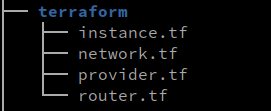
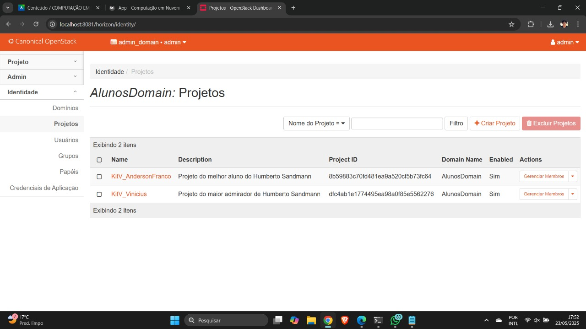
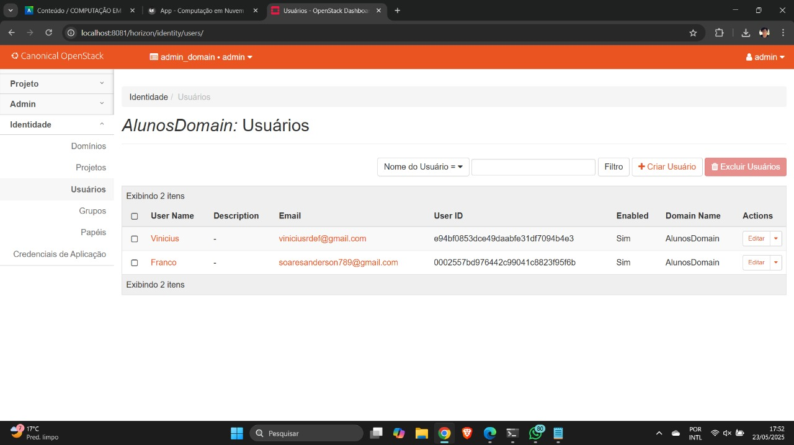
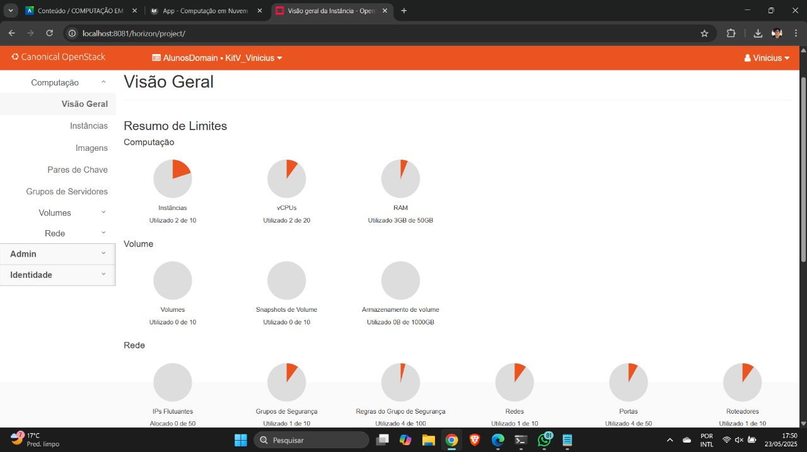
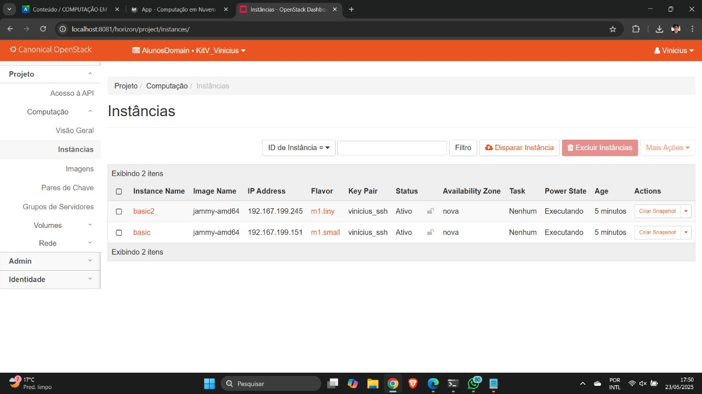
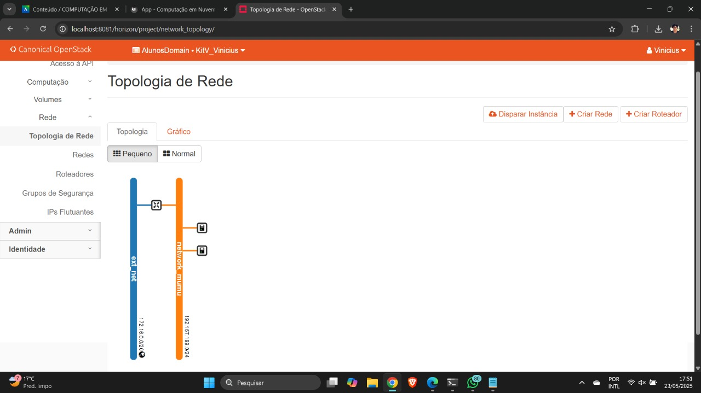
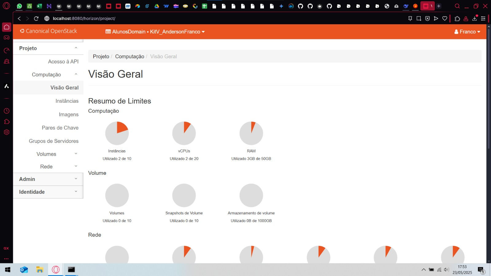
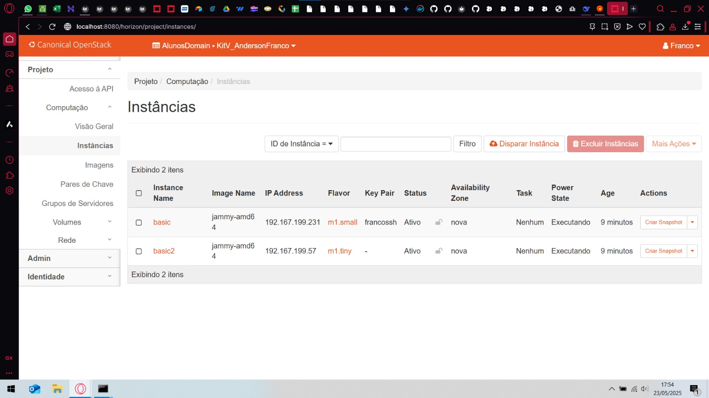
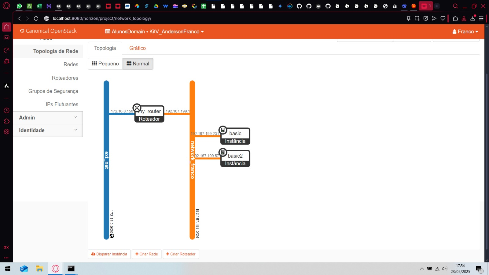

# Objetivos

1. Entender os conceitos básicos Infraestrutura como código.
2. Entender os conceitos básicos sobre SLA e DR.

# Infra

A infraestrutura necessária para cumprir com os objetivos desse roteiro consiste em segmentar por aluno - de forma a criar uma separação lógica entre os recursos utilizados por estes - e estruturar uma hierarquia de projeto para cada através do dashboard do OpenStack.
Para isso, seguimos o seguinte passo-a-passo:

## 1. Criação de um Domain único

No dashboard do OpenStack, nevagamos até Identity > Domains, clicamos em "Create Domain" e adicionamos o domínio AlunosDomain. Em seguida, definimos AlunosDomain como o novo contexto de uso.

## 2. Criação de um projeto para cada aluno

Em Identity > Projects, criamos os projetos `KitV_Vinicius` e `KitV_AndersonFranco`. Em seguida, em Identity > Users, criamos os usuários Vinicius, com papel administrativo no projeto KitV_Vinicius, e AndersonFranco, com papel administrativo no projeto KitV_AndersonFranco.

# Setup

## Criando a Infraestrutura utilizando IaC

Para criar a infraestrutura usando IaC, utilizamos o Terraform. O Terraform conta com arquivos .tf, que definem a infraestrutura.

O Terraform sabe o que é implantado por meio do arquivo de estado. Este estado é armazenado por padrão em um arquivo local chamado “terraform.tfstate”. Também pode ser armazenado remotamente, o que funciona melhor em um ambiente de equipe.

O Terraform permite vários provedores, normalmente inicializados em um arquivo chamado provider.tf.

Em cada projeto criado anteriormente (KitV_Vinicius e KitV_AndersonFranco), criamos a pasta terraform, com a seguinte estrutura de arquivos:



_Fonte: [Roteiro 4 - Cloud](https://insper.github.io/computacao-nuvem/roteiros/4.app/#criando-a-infraestrutura-utilizando-iac)_

Cada um desses arquivos foi preenchido com os templates a seguir e posteriormente modificados com as informações: username, key pair e external network id.

Templates:

`provider.tf`

```
# Terraform Openstack deployment
# Author: Tiago Demay - tiagoaodc@insper.edu.br


# Define required providers
terraform {
required_version = ">= 0.14.0"
  required_providers {
    openstack = {
      source  = "terraform-provider-openstack/openstack"
      version = "~> 1.35.0"
    }
  }
}


# Configure the OpenStack Provider

provider "openstack" {
  region              = "RegionOne"
  user_name           = "SEU_USUARIO"
}
```

`instance1.tf`

```
resource "openstack_compute_instance_v2" "instancia" {
  name            = "basic"
  image_name      = "bionic-amd64"
  flavor_name     = "m1.small"
  key_pair        = "mykey"
  security_groups = ["default"]

  network {
    name = "network_1"
  }

  depends_on = [openstack_networking_network_v2.network_1]

}
```

`instance2.tf`

```
resource "openstack_compute_instance_v2" "instancia" {
  name            = "basic2"
  image_name      = "jammy-amd64"
  flavor_name     = "m1.tiny"
  key_pair        = "mykey"
  security_groups = ["default"]

  network {
    name = "network_1"
  }

  depends_on = [openstack_networking_network_v2.network_1]

}
```

`network.tf`

```
resource "openstack_networking_network_v2" "network_1" {
  name           = "network_1"
  admin_state_up = "true"
}

resource "openstack_networking_subnet_v2" "subnet_1" {
  network_id = "${openstack_networking_network_v2.network_1.id}"
  cidr       = "192.167.199.0/24"
}
```

`router.tf`

```
resource "openstack_networking_router_v2" "router_1" {
  name                = "my_router"
  admin_state_up      = true
  external_network_id = <"ID_EXT_NETWORK">
}

resource "openstack_networking_router_interface_v2" "int_1" {
  router_id = "${openstack_networking_router_v2.router_1.id}"
  subnet_id = "${openstack_networking_subnet_v2.subnet_1.id}"
}
```

### Credenciais do usuário

Para poder carregar as variáveis do ambiente de cada usuário, seguimos o seguinte procedimento:

1. Entramos no dashboard do OpenStack com o usuário de cada aluno, no domínio AlunosDomain;
2. Na aba project → API access, fizemos o download do openstack rc file de cada usuário;
3. Copiamos o conteudo em cada pasta de projeto, num arquivo openrc.sh;
4. Cedemos a permissão de execução para o arquivo `chmod +x arquivo.sh`
5. Carregamos as variáveis de ambiente do administrador executando o comando `source openstack-base/openrc` na raiz do projeto;
6. Carregamos as variáveis de ambiente do nosso projeto executando o comando `source openrc.sh` dentro da pasta do projeto.

### Implementação da infraestrutura

Para implementar a infraestrutura, enfim, rodamos os comandos:

```
terraform plan
terraform apply
```

E através do OpenStack, verificamos a criação das redes.

### Checkpoint - Geral

**Aba Identy > projects no OpenStack.**



**Aba Identy > users no OpenStack.**



### Checkpoint - Vinícius

**Aba Compute > Overview no OpenStack.**



**Aba compute > instances no OpenStack.**



**Aba network > topology no OpenStack.**



### Checkpoint - Anderson Franco

**Aba Compute > Overview no OpenStack.**



**Aba compute > instances no OpenStack.**



**Aba network > topology no OpenStack.**




## Criando um plano de Disaster Recovery e SLA

**a. Escolha da Infraestrutura**

Para este cenário, a **Nuvem Privada** é a escolha mais prudente. A natureza sigilosa dos dados operacionais é o fator primordial, e uma nuvem privada oferece o controle granular sobre segurança, governança e soberania de dados indispensável. Embora possa haver um investimento inicial, o controle sobre a infraestrutura e a previsibilidade de custos a longo prazo para uma carga de trabalho crítica e estável podem resultar em um TCO (Custo Total de Propriedade) vantajoso. Este ambiente dedicado mitiga riscos associados ao compartilhamento de recursos de nuvens públicas, essencial para dados sensíveis.

**b. A Necessidade Estratégica de um Time de DevOps**

A constituição de um time de **DevOps** é fundamental para o sucesso deste projeto. DevOps, como cultura e conjunto de práticas, une Desenvolvimento (Dev) e Operações (Ops), promovendo agilidade e velocidade na entrega de novas funcionalidades e correções através da automação (CI/CD). Isso se traduz em maior qualidade e confiabilidade do sistema, com testes integrados e monitoramento contínuo. A colaboração e comunicação otimizadas entre equipes resultam em resolução de problemas mais eficiente e redução de custos operacionais. Crucialmente, a abordagem DevSecOps integra a segurança em todo o ciclo de vida do sistema, vital para a proteção dos nossos dados sigilosos.

**c. Plano de Resiliência: Disaster Recovery (DR) e Alta Disponibilidade (HA)**

Para um sistema crítico, um plano robusto de DR e HA é imperativo.

* **Principais Ameaças Mapeadas:** Consideramos desastres naturais, falhas de energia prolongadas, falhas de hardware e software, erros humanos, ataques cibernéticos (ransomware, DDoS) e falhas de comunicação.

* **Ações Priorizadas para Recuperação (DR):** Em caso de desastre, o plano prevê:
    1.  Ativação imediata da equipe de resposta e comunicação às partes interessadas.
    2.  Avaliação rápida do impacto.
    3.  Acionamento do site de DR (geograficamente distinto), com RPO (Recovery Point Objective) de minutos e RTO (Recovery Time Objective) de horas.
    4.  Restauração e validação dos dados a partir dos backups mais recentes.
    5.  Validação dos sistemas e redirecionamento dos usuários.
    6.  Monitoramento contínuo e, posteriormente, planejamento do retorno ao site primário (failback).
    7.  Análise pós-incidente para melhoria contínua.

* **Política de Backup:** Implementaremos backups completos semanais, incrementais/diferenciais diários e de logs de transação frequentes. A retenção variará de semanas a anos, conforme a criticidade e conformidade. Cópias serão armazenadas off-site (no site de DR), com criptografia e testes de restauração trimestrais para garantir a integridade.

* **Implementação de Alta Disponibilidade (HA):** A HA será alcançada através de:
    * Redundância em todas as camadas: servidores em cluster, storage com RAID e controladoras duplas, equipamentos de rede redundantes e fontes de energia duplicadas (UPS e geradores).
    * Balanceamento de carga para distribuir o tráfego e evitar pontos únicos de falha.
    * Virtualização para permitir migração rápida de VMs.
    * Clusters de banco de dados com replicação e failover automático.
    * Monitoramento proativo para detecção antecipada de problemas.

Esta estratégia integrada visa assegurar que o novo sistema operacional seja seguro, resiliente e eficiente, suportando as operações críticas da empresa em todo o Brasil.